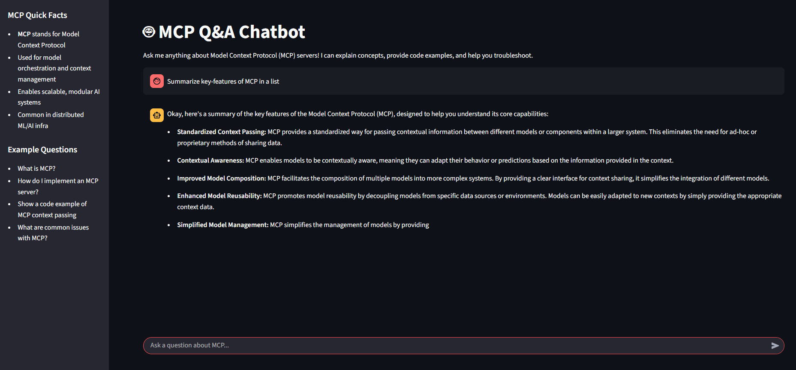

# MCP Chatbot



A conversational AI assistant for answering questions about Model Context Protocol (MCP) servers, built with Streamlit and Gemini (Google Generative AI) via LangChain.

## Features
- Answers questions about MCP concepts, implementation, best practices, and troubleshooting
- Uses Google Gemini (Generative AI) via API key
- Simple Streamlit web interface

## Setup

1. **Clone the repository**
2. **Install dependencies**
   - Activate your conda environment: `conda activate llm`
   - Install Python dependencies:
     ```bash
     pip install -r requirements.txt
     ```
   - (Or, if using `pnpm` for any Node.js parts, use `pnpm install`)
3. **Set up your API key**
   - Copy your Gemini API key into a `.env` file:
     ```env
     GEMINI_API_KEY = "your-gemini-api-key"
     ```

## Running the App

```bash
streamlit run app.py
```

## File Structure
- `app.py` — Streamlit web app entry point
- `main.py` — Core logic for interacting with Gemini
- `.env` — Your API key (not committed)
- `image.png` — Project image/logo

## Notes
- Requires Python 3.10+
- Make sure your `.env` file is present and correct
- For any issues with Google credentials, ensure the API key is loaded as shown in `main.py`

---

*Made with ❤️ for MCP learning and support.* 